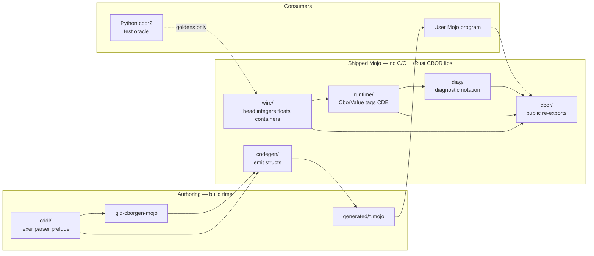

# CBOR for Mojo (`mojo-cbor`)

| Field | Value |
| --- | --- |
| **Document title** | Concise Binary Object Representation serializer for the Mojo programming language |
| **Author** | Leonid Ganeline |
| **Date** | 2026-09-08 |
| **Status** | Draft (rev 2) |
| **Target repo** | `/home/leo/PycharmProjects/GLD/gld-cbor` (greenfield standalone library; only a local `.env` as of 2026-09-08) |
| **License** | MIT, Copyright (c) 2026 Leonid Ganeline |
| **Recommended Mojo pin** | `mojo == 1.0.0` (stable, 2026-08-11) |
| **Spec targets** | [RFC 8949](https://www.rfc-editor.org/rfc/rfc8949.html) (CBOR; preferred §4.1, core deterministic encoding §4.2.1), [RFC 8742](https://www.rfc-editor.org/rfc/rfc8742.html) (CBOR Sequences), [RFC 8610](https://www.rfc-editor.org/rfc/rfc8610.html) (CDDL), [draft-ietf-cbor-cde](https://datatracker.ietf.org/doc/draft-ietf-cbor-cde/) (CDE profile on top of §4.2.1) |

---

## Overview

There is no production CBOR implementation for Modular Mojo as of 2026-09-08 (GitHub / Modular / modular-community search; this is a search result, not a hard negative proof). This document specifies a **standalone, from-scratch Mojo** CBOR library for the empty `gld-cbor` repository: independently buildable layers (`wire`, `diag`, `cddl`, `codegen`, `runtime`) plus a `cbor` facade, a Mojo CLI that reads CDDL in-process, generated structs with explicit encode/decode, and a dynamic `CborValue` tree that can encode and decode any well-formed item without a schema.

**Hard product constraint:** the shipped runtime and the codegen walker have **zero C, C++, or Rust CBOR library dependencies**. They do not wrap, link, FFI, bind, or vendor libcbor, tinycbor, cn-cbor, QCBOR, ciborium, minicbor, serde_cbor, or cbor-diag. Python `cbor2` is a **test oracle** only. No host CDDL compiler is required to run codegen.

v1 ships the full encoding surface the user locked: RFC 8949 complete (definite and indefinite lengths, tags, simple values, half/float/double), RFC 8742 CBOR Sequences, and diagnostic notation. Both codegen and `CborValue` ship in v1. Default write is RFC 8949 **preferred serialization** (§4.1): shortest arguments, definite lengths, shortest value-preserving float, **no map-key sort**. Optional write is RFC 8949 **core deterministic encoding** (§4.2.1), which this library calls CDE and aligns with `draft-ietf-cbor-cde`: preferred plus encoded-key sort and no duplicate keys. Strict decode re-encodes with CDE and compares bytes. Standard tags 0, 1, 2, 3, 4, 5, 24, and 32 have first-class codecs.

The first test records (`Message`, `Document`, `Telemetry`, `Strings`, `Event`, `Batch_*`, `LongList`, mutual `A`/`B`) live under this repo’s `testdata/` as ordinary unit and interop test material. They are not the product schema and they are not a dependency on any other repository.

---

## Background & Motivation

### Why this change is needed

Mojo 1.0 shipped on 2026-08-11 with source stability, ownership, and C FFI. A Mojo program that speaks CBOR today would have to wrap CPython `cbor2` or link libcbor. That measures someone else's runtime, fights Mojo ownership on every `String` / `List` crossing, and violates the no-CBOR-native-library rule. This repo is a reusable Mojo codec and codegen tool.

The sibling libraries `gld-protobuf` and `gld-avro` proved the product shape: pixi + Mojo 1.0, layered packages, generated structs, Python oracle goldens, MkDocs Pages, conda `mojoc` on prefix.dev. CBOR is a different format. The wire is self-describing (major type in every head byte), maps have arbitrary keys, and the schema language is CDDL rather than `.proto` or `.avsc`. The product packaging is the same.

### Current state of the repo

- `/home/leo/PycharmProjects/GLD/gld-cbor` is an empty directory except a local `.env` that holds `PREFIX_API_KEY`. It is not a git repository.
- `leo-gan/gld-cbor` does not exist on GitHub yet.
- No Modular-Mojo CBOR package was found in the 2026-09-08 search.

### Pain points this library must not inherit

- A stub that only knows the five v2 test records.
- Any linked C/C++/Rust CBOR implementation.
- A reflection-only encoder: Mojo reflection sees Mojo fields, not CBOR major types or tag numbers.
- Treating diagnostic notation as `String` formatting of a dict.
- Claiming CDE while emitting indefinite lengths or unsorted map keys.
- Coupling the library to `serializer-benchmark` or any other monorepo.
- Committing `.env` or `temp/`.

---

## Goals & Non-Goals

### Goals (v1 product)

1. **100% from-scratch Mojo** encode/decode of RFC 8949 items, RFC 8742 sequences, and diagnostic notation.
2. Independently buildable layers: `wire/`, `diag/`, `cddl/`, `codegen/`, `runtime/`, plus `cbor/` facade.
3. Parse RFC 8610 CDDL (v1 subset below) in Mojo. No host CDDL compiler is required to run codegen.
4. CLI `gld-cborgen-mojo` emits typed Mojo structs with explicit `encoded_len` / `encode_to` / `decode_from`.
5. Dynamic `CborValue` (arena of nodes) for schema-free encode/decode of any well-formed item.
6. Default write is preferred serialization (RFC 8949 §4.1). Optional CDE write, optional dCBOR write, and strict CDE decode (RFC 8949 §4.2.1 / `draft-ietf-cbor-cde`).
7. First-class codecs for tags 0, 1, 2, 3, 4, 5, 24, 32. Other tags stay `CborTag(number, value)`.
8. CDDL `?` / optional map members map to `Optional[T]`.
9. Interop on known data with official Python `cbor2`.
10. Decoder walks a `Span[Byte]`. Encoder writes into a `List[Byte]` pre-sized from `encoded_len` when the size is known. Owned `String` / `List[Byte]` on decode. Definite text can also be viewed as `StringSpan` (`decode_tstr_span` / `WireReader.read_text_span`). Sequences can be pulled one item at a time with `SeqDecoder` (`next_value` / `skip`) without buffering the whole input.
11. Typed `DecodeError` with `kind: Int`, `offset: Int`, and `field: Int` (`0` means unknown).
12. Independently useful library. Not coupled to any other project.
13. Recursive named types in generated code: detect cycles on the named-type graph with strongly connected components. Emit heap `Box` for any field whose type (after unwrapping optional / array) is in the current type’s SCC. Testdata includes `LongList` and mutual `A`/`B`. Non-optional recursive fields are a codegen error.

### Non-goals (v1)

- COSE (RFC 9052), CWT, or any application profile built on CBOR.
- Packed CBOR (RFC 9595).
- dCBOR decode-time validation and the rest of the Gordian profile (envelope, known-value registry). Write-mode `EncodeOptions.dcbor` is implemented.
- CBOR Pretty Printing beyond diagnostic notation.
- Multi-file CDDL `export` catalogs (more than one `include`).
- Full PCRE (lookbehind, backreferences). `.regexp` is the implemented subset; `.pcre` is accepted as an alias of that subset.
- GPU encode/decode.
- Reflection-driven encode of arbitrary non-generated Mojo structs.
- C/C++/Rust CBOR libraries, even as an optional path.

### Later (explicitly planned, not v1)

These four items are implemented (2026-09-08):

- CDDL sockets (`$name` / `$$name` with `/=` and `//=` plugs), generic application `name<T, U>`, and `.regexp` / `.pcre` controls.
- Tags 4 and 5 first-class codecs (`DecimalFraction`, `BigFloat`).
- Zero-copy `StringSpan` views on decode (`decode_tstr_span`, `WireReader.read_text_span`).
- Streaming pull decoder (`SeqDecoder`) that yields or skips one sequence item without buffering the rest.

Also implemented (2026-09-08, ready-now set):

- Local `include "file.cddl"` of **one** extra file (the included file cannot include).
- Unwrap `~` and parenthesized groups as types.
- Controls `.bits`, `.ibits`, `.and`, `.within`, `.andcbor` parse as `CT_CONTROL`.
- `encode_diag_pretty` (indented diagnostic notation).
- `EncodeOptions.dcbor`: definite, text keys only, CDE key sort, no `undefined` / unassigned simples / NaN / Infinity; integer-valued floats become integers.

Also implemented (2026-09-08, remaining later set):

- CDDL `export` catalogs and nested `include` (cycle on a path already on the include stack is an error). `import Name from "file.cddl"` loads that file and requires `Name` to be exported.
- A larger regexp engine: `{n,m}`, capturing groups, `(?:)`, lookahead, lookbehind, backreferences `\\1`–`\\9`, and `\\d\\D\\w\\W\\s\\S\\b\\B`. This is not a full PCRE library (no recursive patterns, no callouts).
- Zero-copy views of indefinite text as one `StringSpan` per definite chunk (`decode_tstr_chunks` / `WireReader.read_text_chunks`). A single `StringSpan` of the concatenation is still impossible without copying.

---

## Proposed Design

### Product naming

| Surface | Name | Rationale |
| --- | --- | --- |
| Git repository | `gld-cbor` | Directory already created; GitHub repo to create. |
| Public Mojo import | `cbor` | What generated code and apps write (`from cbor import …`). |
| Conda / pixi package | `mojo-cbor` | Avoids colliding with conda-forge / PyPI `cbor`. |
| Codegen CLI | `gld-cborgen-mojo` | Matches `gld-protoc-mojo` / `gld-avrogen-mojo`. |
| Trait | `CborDatum` | Generated test type `Message` keeps the name `Message`. |

### Packaging bootstrap (locked)

| Fact | Value |
| --- | --- |
| Initial `pixi.toml` version | `0.1.0`. Intermediate PRs do not bump it. One bump + prefix.dev publish after PRs 1–14 are on `main`. |
| Channels | `https://conda.modular.com/max` and `conda-forge`. |
| Platforms | `["linux-64"]`. |
| Mojo pin | `mojo == 1.0.0` in pixi; recipe build pin `mojo-compiler == 1.0.0`. |
| `from cbor import …` | Development: `mojo -I src`. Installed package: `$PREFIX/lib/mojo/cbor.mojoc` plus the other published `.mojoc` files. Generated code imports only the `cbor` facade. |
| Oracle extra | pixi feature `oracle` with `python` and `cbor2` for `scripts/gen_golden.py`. Not a runtime dependency. |
| Recipe about | homepage / repository `https://github.com/leo-gan/gld-cbor`; license MIT; test via `conda.recipe/test_import.mojo`. |
| Secrets | `.env` and `temp/` are gitignored. `PREFIX_API_KEY` is a GitHub Actions secret and a local file. It is never committed. |

**Precompile order** (`scripts/precompile.sh`). The graph is acyclic: `diag` walks `CborValue` and therefore depends on `runtime`. `runtime` does **not** import `cddl`. Generated types never parse CDDL at runtime.

1. `wire.mojoc` (no in-repo deps)
2. `cddl.mojoc` (std only)
3. `runtime.mojoc` (needs `wire`)
4. `diag.mojoc` (needs `wire` and `runtime`)
5. `cbor.mojoc` (needs all of the above)

The CLI is a separate `mojo build` of `src/codegen/cli.mojo` → `gld-cborgen-mojo`.

### Four-plus-two layer architecture

```text
gld-cbor/
├── src/wire/      # RFC 8949 head, integers, floats, bstr/tstr, arrays/maps, indefinite
├── src/diag/      # diagnostic notation
├── src/cddl/      # CDDL lexer, parser, prelude, model
├── src/codegen/   # gld-cborgen-mojo
├── src/runtime/   # CborValue, tags, sequences, preferred/CDE, CborDatum
└── src/cbor/      # public facade
```



---

## Wire format (RFC 8949)

### Initial byte

Every item starts with one head byte:

| Bits | Field |
| --- | --- |
| 7–5 | Major type 0–7 |
| 4–0 | Additional information |

Additional information:

| AI | Meaning |
| --- | --- |
| 0–23 | The value is the AI itself |
| 24 | One extra byte (uint8 argument) |
| 25 | Two extra bytes (uint16, big-endian) |
| 26 | Four extra bytes (uint32, big-endian) |
| 27 | Eight extra bytes (uint64, big-endian) |
| 28–30 | Reserved. `KIND_RESERVED_AI` |
| 31 | Indefinite length. Legal only for majors 2, 3, 4, 5, and 7 (break). Otherwise `KIND_INDEF` |

Argument bytes are **big-endian**. This is the opposite of Avro and protobuf fixed widths.

### Major types

| Major | Name | Argument |
| --- | --- | --- |
| 0 | unsigned integer | the value |
| 1 | negative integer | the value `n` means `−1 − n` |
| 2 | byte string | length, or 31 for indefinite |
| 3 | text string | length in UTF-8 bytes, or 31 |
| 4 | array | item count, or 31 |
| 5 | map | pair count, or 31 |
| 6 | tag | tag number; then one nested item |
| 7 | simple / float | 20–23 simples; 25/26/27 half/float/double; 31 break |

### Integer policy (locked)

- A major-0 argument that fits in `Int64` (0 … 2^63−1) is `CborValue` kind `INT` with a non-negative `Int64`.
- A major-0 argument in 2^63 … 2^64−1 is kind `UINT` with a `UInt64`. Generated `int` fields that overflow `Int64` raise `KIND_RANGE`.
- A major-1 argument `n` where `−1 − n` fits in `Int64` is kind `INT`. The most negative `Int64` is major 1, argument `2^63 − 1`.
- A major-1 argument that would be less than `Int64.MIN` is `KIND_RANGE`. Tag 3 is a **bstr**, never a major-1 head, so it is not an exception to this rule.
- An integer that does not fit in 64 bits cannot arrive as a major 0/1 head (the head argument is at most 8 bytes). Bigger integers arrive only as tags 2 and 3 wrapping a bstr.

Preferred write of an `Int64`:

- `v >= 0` → major 0, shortest AI.
- `v < 0` → major 1, argument `−1 − v`, shortest AI.

Preferred write of a `UInt64` greater than `Int64.MAX` is major 0 with 8-byte argument (or shorter if it still fits; it will not).

Overlong integer encodings (AI 24 with value ≤ 23, and so on) are **well-formed** on read and **forbidden** on preferred/CDE write.

### Floats

| AI | Width | Bytes |
| --- | --- | --- |
| 25 | IEEE 754 binary16 | 2 |
| 26 | IEEE 754 binary32 | 4 |
| 27 | IEEE 754 binary64 | 8 |

Half-float conversion is implemented in Mojo in `src/wire/half.mojo`. No C math library is linked for this.

`CborValue` stores the original width on decode (`FLOAT16` / `FLOAT32` / `FLOAT64`) plus the bit pattern, so a generic round-trip of a half-float stays a half-float when the caller asks for **identity** encode. Preferred encode of a *computed* `Float64` uses the shortest width that preserves the numeric value, including signed zero.

**NaN policy (locked):**

- RFC 8949 §4.1 / §4.2.1 shorten a NaN only when the trailing payload bits are zero. They do **not** rewrite every NaN to `f97e00`.
- Preferred and CDE write of a **zero-payload** NaN (including a generated `Float64` NaN) is the half-float quiet NaN `f9 7e 00`.
- `EncodeOptions.IDENTITY` writes the stored width and payload bits unchanged.
- Decode always preserves the incoming NaN payload and width inside `CborValue`.
- Generated `Float64` fields materialize `Float64` via `Float64(from_bits=…)`. Non-zero NaN payloads are accepted on read.
- Strict CDE decode re-encodes with CDE and compares bytes. A legal CDE NaN that is not `f97e00` (non-zero payload at its shortest width) is accepted if it matches that CDE rewrite.

Infinities stay infinite at the shortest width that can represent them (half-float `f97c00` / `f9fc00`).

### Simple values

| Value | Meaning |
| --- | --- |
| 20 | false |
| 21 | true |
| 22 | null |
| 23 | undefined |
| 0–19 | unassigned simple; tiny AI only; stored as `SIMPLE` |
| 24–31 | reserved; **no legal encoding** |
| 32–255 | unassigned simple; AI 24 plus one byte; stored as `SIMPLE` |

RFC 8949 §3.3: a decoder **must** treat `0xf8` followed by a byte `< 0x20` as not well-formed (`KIND_SIMPLE` on every decode, not only strict). Simples 0–23 exist only as the tiny-AI form. Simples 24–31 cannot be encoded. Unassigned simples 0–19 and 32–255 are well-formed and round-trip as `SIMPLE`.

Break is major 7, AI 31, byte `0xFF`. It is not a value. Seeing break outside an indefinite container is `KIND_BREAK`.

### Byte and text strings

Definite: head with length N, then N bytes. Text must be well-formed UTF-8 (`KIND_UTF8`).

Indefinite: head AI 31, then zero or more **definite** chunks of the same major type, then break. A nested indefinite chunk is `KIND_INDEF`. Mixed chunk majors are `KIND_TYPE`. For text, each chunk must be valid UTF-8 **and** the concatenation must be valid UTF-8 (a code point must not be split across chunks) — `KIND_UTF8`.

Preferred and CDE write always emit one definite string. The encoder concatenates chunks first.

Maximum allocation: a length that does not fit in `Int` or that exceeds remaining input is `KIND_RANGE` / `KIND_EOF`. There is a decode cap `MAX_ITEM_BYTES = 64_194_304` on a single string or on the concatenated indefinite result.

### Arrays and maps

Definite array: count N, then N items. Definite map: count N, then N key/value pairs (2N items).

Indefinite: items until break. An indefinite map must end on a pair boundary; a dangling key before break is `KIND_MAP_PAIR`.

`CborValue` maps are an ordered **list of pairs**. Keys may be any item, including arrays. This is not a `Dict`. Duplicate keys are well-formed on generic decode; **all pairs are kept** in order. Generated structs and `as_text_map` take the **last** pair for a given text key.

Preferred write of a map (RFC 8949 §4.1):

- Definite length. Shortest encoding of each key and value.
- **No key sort.** Pair order is the order stored in the arena or the CDDL member order for generated structs.
- Duplicate keys are a writer error (`KIND_DUP_KEY`) for `CborValue`. Generated structs never have duplicate keys (see codegen rules).

CDE write of a map (RFC 8949 §4.2.1):

- Same as preferred, then sort pairs by the **encoded key bytes** (the full preferred encoding of the key, including the head). Encoded `"z"` (`61 7a`) sorts before encoded `"aa"` (`62 61 61`). This is not UTF-8 content order.
- Duplicate keys are `KIND_DUP_KEY`.

### Tags

Major 6, then one nested item. Nested tags are allowed. Depth is capped at `MAX_DEPTH = 100` (`KIND_DEPTH`).

`CborValue` kind `TAG` stores the tag number as `UInt64` and a child node index.

### Depth and size caps

| Cap | Value | Error |
| --- | --- | --- |
| Nesting depth (array/map/tag) | 100 | `KIND_DEPTH` |
| Single string / bstr | 64_194_304 | `KIND_RANGE` |
| Array or map pair count | 1_048_576 | `KIND_RANGE` |
| Sequence item count | 1_048_576 | `KIND_RANGE` |

---

## Preferred serialization and CDE

`EncodeOptions` is a small struct:

```mojo
struct EncodeOptions(Copyable, ImplicitlyCopyable):
    var mode: Int

    comptime PREFERRED = 0
    comptime CDE = 1
    comptime IDENTITY = 2
    comptime DCBOR = 3

    comptime preferred = EncodeOptions(mode=Self.PREFERRED)
    comptime cde = EncodeOptions(mode=Self.CDE)
    comptime identity = EncodeOptions(mode=Self.IDENTITY)
    comptime dcbor = EncodeOptions(mode=Self.DCBOR)
```

Default `encode(...)` uses `preferred`.

| Rule | Preferred (§4.1) | CDE (§4.2.1) | Identity | dCBOR |
| --- | --- | --- | --- | --- |
| Shortest integer AI | yes | yes | keep stored AI width | yes |
| Definite lengths only | yes | yes | keep `indef` bit | yes |
| Shortest float that preserves value | yes | yes | keep stored width and bits | yes; integer-valued floats become ints |
| Zero-payload NaN | `f97e00` | `f97e00` | keep stored bits | reject (`KIND_CDE`) |
| Non-zero NaN payload | shortest width that holds the payload | same | keep stored bits | reject |
| Infinity | shortest float | shortest float | keep stored bits | reject |
| Map key order | **no sort** (stored / CDDL order) | sort by **encoded key bytes** | no sort | CDE key sort |
| Text keys only | no | no | no | yes; other key kinds reject |
| Duplicate keys | reject on `CborValue` write | reject | reject | reject |
| Simple 0–23 | tiny AI | tiny AI | tiny AI | tiny AI |
| `undefined` / unassigned simples | written | written | written | reject |
| `0xf8` + byte `< 0x20` | never written; **not well-formed on any decode** | same | same | same |

Strict CDE decode is not a fourth write mode. `decode_strict` decodes to `CborValue`, re-encodes with CDE, and compares bytes to the input. That accepts every legal CDE encoding, including a non-`f97e00` NaN that §4.2.1 still considers shortest.

---

## RFC 8742 sequences

A sequence is zero or more concatenated CBOR items with no extra framing. An empty buffer is a valid empty sequence.

```mojo
def encode_seq[T: CborDatum](items: List[T], options: EncodeOptions = EncodeOptions.preferred) -> List[Byte]
def decode_seq[T: CborDatum, origin: ImmOrigin](buf: Span[Byte, origin]) raises DecodeError -> List[T]
def decode_seq_values[origin: ImmOrigin](buf: Span[Byte, origin]) raises DecodeError -> List[CborValue]
```

There is no trailing garbage rule for a sequence: the decoder consumes items until the buffer ends. A truncated final item is `KIND_EOF`.

`decode[T](buf)` (single item) **does** require that the buffer contain exactly one item. Leftover bytes are `KIND_TRAILING`.

---

## Diagnostic notation

Encode is always implemented and is the inverse of a well-formed item:

| Item | Diagnostic |
| --- | --- |
| unsigned | decimal, or `0x…` only if we choose decimal always (v1 encode uses decimal) |
| negative | decimal including the minus |
| bstr | `h'a1b2'` lowercase hex |
| tstr | `"…"` with RFC 8949 escapes |
| array | `[1, 2, 3]` |
| map | `{1: 2, "a": "b"}` |
| tag | `1(1363896240)` |
| false/true/null/undefined | those tokens |
| simple N | `simple(N)` |
| float | shortest decimal or `Infinity` / `-Infinity` / `NaN` |
| indefinite | `[_ 1, 2]` / `{_ "a": 1}` / `(_ h'01', h'02')` / `(_ "a", "b")` |

v1 **diag decode** accepts this closed subset:

- integers (decimal, optional minus, `0x` hex)
- floats (decimal, `Infinity`, `-Infinity`, `NaN`)
- `"…"` text with `\"` `\\` `\n` `\t` `\uXXXX`
- `h'…'` byte strings (even number of hex digits, whitespace allowed inside)
- arrays `[ … ]` and maps `{ … }` with commas
- tags `N(item)`
- `true` `false` `null` `undefined` `simple(N)`
- indefinite marker `_` as the first element of `[]`, `{}`, or `()` for bstr/tstr
- `#` line comments to end of line
- whitespace

v1 diag decode does **not** accept `b64'…'`, `<< >>` embedded CBOR, or `'` single-quoted text. Those are later.

---

## `CborValue` data model

Mojo 1.0 cannot form a Deinitable recursive enum. `CborValue` is an arena:

```mojo
comptime CK_INT = 1
comptime CK_UINT = 2
comptime CK_BYTES = 3
comptime CK_TEXT = 4
comptime CK_ARRAY = 5
comptime CK_MAP = 6
comptime CK_TAG = 7
comptime CK_FALSE = 8
comptime CK_TRUE = 9
comptime CK_NULL = 10
comptime CK_UNDEFINED = 11
comptime CK_SIMPLE = 12
comptime CK_FLOAT16 = 13
comptime CK_FLOAT32 = 14
comptime CK_FLOAT64 = 15

struct CborNode(Copyable, ImplicitlyCopyable):
    var kind: Int
    var a: Int64      # signed int; array/string start index; first map key index
    var b: UInt64     # uint payload, tag number, float bits, count
    var c: Int        # tag child; first map value index; unused
    var flags: Int    # bit 0 = indefinite
```

**Packing (locked):**

| Kind | `a` | `b` | `c` | `flags` |
| --- | --- | --- | --- | --- |
| `CK_INT` | `Int64` value | 0 | 0 | 0 |
| `CK_UINT` | 0 | `UInt64` value | 0 | 0 |
| `CK_BYTES` / `CK_TEXT` | start in `bytes` / `texts` | length | 0 | bit 0 if indefinite |
| `CK_ARRAY` | first child index | count | 0 | bit 0 if indefinite |
| `CK_MAP` | first **key** index | pair count | first **value** index | bit 0 if indefinite |
| `CK_TAG` | 0 | tag number as `UInt64` | child index | 0 |
| `CK_SIMPLE` | simple value 0–255 | 0 | 0 | 0 |
| `CK_FLOAT16/32/64` | 0 | IEEE bits in the low 16/32/64 | 0 | 0 |
| `CK_FALSE/TRUE/NULL/UNDEFINED` | 0 | 0 | 0 | 0 |

Map decode appends all keys in order, then all values in the same order. Pair `i` is `nodes[first_key + i]` / `nodes[first_value + i]`. Array decode appends children contiguously.

Identity encode and diagnostic encode read the `indef` flag so `0x9f 01 ff` prints as `[_ 1]`. Preferred and CDE write ignore `indef` and emit definite forms.

`CborTag` is a small view: `number: UInt64` (from `b`), `content` node index (from `c`), shared arena.

Public constructors on the facade: `cbor_int`, `cbor_uint`, `cbor_text`, `cbor_bytes`, `cbor_array`, `cbor_map`, `cbor_tag`, `cbor_bool`, `cbor_null`, `cbor_undefined`, `cbor_float`.

---

## Standard tag codecs

| Tag | Content | Mojo type | Encode | Decode |
| --- | --- | --- | --- | --- |
| 0 | tstr RFC 3339 | `String` (validated) | tag 0 + text | require text; `KIND_TAG` if not RFC 3339-shaped (`YYYY-MM-DDThh:mm:ss` with optional fraction and `Z` / `±hh:mm`) |
| 1 | int or float | `EpochTime` (`var sec: Float64`) | integer seconds if the value is integral and fits `Int64`, else float | int or float → `Float64` seconds |
| 2 | bstr | `BigUint` (`var bytes: List[Byte]`) network-endian | tag 2 + bstr: empty for zero, otherwise no leading zeros | require bstr |
| 3 | bstr | `BigNint` (`var bytes: List[Byte]`) value is `−1 − n` | tag 3 + bstr of `n`: empty for −1 (`n = 0`), no leading zeros | require bstr |
| 24 | bstr of one item | `EncodedCbor` (`var item: CborValue`) | tag 24 + definite bstr of preferred/CDE inner | require bstr; parse exactly one inner item |
| 32 | tstr URI | `Uri` (`var text: String`) | tag 32 + text | require text; `KIND_TAG` if empty or contains a space |
| 4 | array `[exp, mantissa]` | `DecimalFraction` | tag 4 + 2-array | value is mantissa × 10^exp. Mantissa may be int or tag 2/3 |
| 5 | array `[exp, mantissa]` | `BigFloat` | tag 5 + 2-array | value is mantissa × 2^exp. Mantissa may be int or tag 2/3 |

Unknown tags stay `CborTag`. Generated CDDL `#6.n(T)` fields use the matching codec when `n` is one of the eight; otherwise they are `CborTag` with typed content `T`. Prelude names `decimalfraction` and `bigfloat` are tags 4 and 5.

Preferred and CDE encode of a numeric value that fits `Int64` or `UInt64` uses major 0 or 1, not tags 2/3. `BigUint` / `BigNint` are **always-tagged** types: the caller asked for a bignum, so encode always writes tag 2/3. Zero is an empty bstr (`C2 40` / `C3 40`).

---

## CDDL v1 subset

### Lexer

Tokens: identifiers, integers, floats, text literals, `/` `=>` `:` `=` `/=` `?` `*` `+` `(` `)` `[` `]` `{` `}` `<` `>` `,` `.` `..` `...` `#` `#6.N` control names (`.size` …), `;` line comments. `;` comments run to end of line. Whitespace is ignored.

The parser **accepts** sockets, generic application, `.regexp` / `.pcre`, unwrap `~`, parenthesized groups, `.bits` / `.ibits` / `.and` / `.within` / `.andcbor`, nested `include`, and `export` / `import Name from "file.cddl"`. Group choice `//` inside a type is still rejected; `//=` is only an assignment operator for group sockets. An include of a path already on the stack is a cycle and is rejected.

### Grammar accepted

```
cddl        = assignment+
assignment  = id "=" type
            | id "/=" type          ; type choice extend; v1 treats as /
type        = type1 ("/" type1)*
type1       = type2 [ctlop type2]
type2       = value / named / prelude / container / tag / range
container   = "{" group "}" | "[" group "]" | "(" group ")"
group       = [member ("," member)* [","]]
member      = [occur] [memberkey] type
memberkey   = bareword ":" | type "=>" | type ":"
occur       = "?" | "*" | "+" | uint "*" [uint] | uint "*"
tag         = "#6." uint "(" type ")" | "#6." uint
range       = int ".." int | int "..." int
ctlop       = ".size" / ".eq" / ".ne" / ".le" / ".lt" / ".ge" / ".gt" / ".default" / ".cbor" / ".cborseq"
```

A construct that is in this grammar but that codegen does not implement is a **codegen** `CddlError`. A token or production outside this grammar is a **parse** `CddlError`. PR 8 implements the parser only.

### Prelude (implemented)

`any`, `uint`, `nint`, `int`, `integer` (alias `int`), `bigint` (alias `int` in v1; values that do not fit `Int64` still `KIND_RANGE` unless the type is `biguint`/`bignint`), `bstr`, `bytes` (alias bstr), `tstr`, `text` (alias tstr), `bool`, `null`, `nil` (alias null), `undefined`, `float`, `float16`, `float32`, `float64`, `number` (`int / float`), `tdate` (`#6.0(tstr)`), `time` (`#6.1(number)`), `biguint` (`#6.2(bstr)`), `bignint` (`#6.3(bstr)`), `encoded-cbor` (`#6.24(bstr)`), `uri` (`#6.32(tstr)`).

### Controls implemented

`.size`, `.eq`, `.ne`, `.le`, `.lt`, `.ge`, `.gt`, `.default`, `.cbor`, `.cborseq`.

`.size` on `tstr`/`bstr`/array becomes a decode check and, when the size is a constant, a codegen assertion. `.default` supplies the zero-arg `__init__` value for an optional member. `.cbor` on a `bstr` means tag-24-style nested item of the given type (without requiring tag 24). `.cborseq` means the bstr holds a sequence.

### Codegen mapping

| CDDL | Mojo |
| --- | --- |
| `bool` | `Bool` |
| `int` / `uint` that fits | `Int64` / `UInt64` |
| `float*` / `number` | `Float64` |
| `tstr` | `String` |
| `bstr` | `List[Byte]` |
| `null` | not a field type alone |
| `tdate` | `String` (tag 0 codec) |
| `time` | `EpochTime` |
| `biguint` / `bignint` | `BigUint` / `BigNint` |
| `uri` | `Uri` |
| `{ a: T, ? b: U }` | struct fields `a: T`, `b: Optional[U]`; encode omits `None`; decode ignores unknown keys |
| `{ * tstr => T }` | `List[MapEntry[T]]` (`key: String`, `value: T`); encode last-wins on duplicate keys |
| `{ 1 => T }` / `type =>` | map whose keys use that CBOR encoding, not text |
| `[* T]` / `[+ T]` | `List[T]` (`+` rejects empty on decode); definite array on the wire |
| `[T]` | Mojo field type `T`, still a definite 1-array on the wire |
| `[n*m T]` | `List[T]` with min/max checks |
| `A / B` where one is `null` | `Optional` of the other |
| other `A / B / C` | tagged union struct `{ var tag: Int; … }` |
| `#6.n(T)` known n | codec type above |
| `#6.n(T)` other n | struct `{ var tag: UInt64; var value: T }` |

Named type → one `.mojo` file under `--out`, package path from the file stem. Identifiers that are Mojo keywords get a trailing underscore (`struct_` , `fn_`).

Recursive named types: mutual reachability on the named-type graph (same SCC). A field whose type, after unwrapping `Optional` / array / map-value, is in the current SCC becomes `Box[T]`. Nullable recursive fields are `Optional[Box[T]]` defaulting to `None`. A non-optional recursive field is a codegen error. A tagged union whose every branch is recursive is a codegen error; otherwise zero-arg init uses the first non-recursive branch. Mojo 1.0 still rejects *compiling* a struct that names itself through `Box[Self]`; the emitter writes that form and tests check the source.

Emitter writes explicit zero-arg `__init__` (zeros, empty lists, `None`) and a fieldwise overload. No `@fieldwise_init`.

CLI:

```bash
gld-cborgen-mojo --cddl testdata/cddl/benchmark_v2.cddl --out tests/generated
```

`--out` is the directory. The emitter never writes `__init__.mojo` above `--out`.

---

## Mojo 1.0 wire contracts

These names are frozen for codegen.

```mojo
struct WireWriter(Movable):
    var buf: List[Byte]
    def __init__(out self, *, capacity: Int = 64)
    def write_byte(mut self, b: Byte)
    def write_head(mut self, major: Int, argument: UInt64)   # shortest AI
    def write_head_raw(mut self, major: Int, ai: Int, argument: UInt64)  # identity
    def write_break(mut self)
    def finish(deinit self) -> List[Byte]

struct WireReader[origin: ImmOrigin](Movable):
    var data: Span[Byte, Self.origin]
    var pos: Int
    var depth: Int
    var max_depth: Int
    def __init__(out self, data: Span[Byte, Self.origin], *, depth: Int = 0, max_depth: Int = 100)
    def remaining(self) -> Int
    def position(self) -> Int
    def read_head(mut self) raises DecodeError -> Tuple[Int, UInt64, Int]  # major, argument, ai
    def read_break_or_item(mut self) raises DecodeError -> Bool  # True if break
```

`decode`, `decode_value`, `decode_seq`, and `decode_from` are parameterized by `origin` on the input `Span[Byte, origin]`.

`string_from_utf8` catches the default `Error` from `String(from_utf8=)` and raises `DecodeError(KIND_UTF8, offset)`.

`Box[T]` is re-exported from `cbor`. It is a heap cell, not `Defaultable`. Implementation matches `gld-avro`: a one-element `List[T]` (a raw `Pointer` cell double-frees on copy in Mojo 1.0). API: `__init__(var value: T)` and `__getitem__` returning a copy of `T`.

## Runtime API

The generated method is **`decode_from`**, not `merge_from`. CBOR replace semantics: the receiver is overwritten. Extra map keys are ignored. There is no unknown-field store.

```mojo
trait CborDatum(Defaultable, Movable):
    def encoded_len(self, options: EncodeOptions) -> Int
    def encode_to(self, mut w: WireWriter, options: EncodeOptions)
    def decode_from[origin: ImmOrigin](mut self, mut r: WireReader[origin]) raises DecodeError

def encode[T: CborDatum](value: T, options: EncodeOptions = EncodeOptions.preferred) -> List[Byte]
def decode[T: CborDatum, origin: ImmOrigin](buf: Span[Byte, origin]) raises DecodeError -> T
def decode_strict[T: CborDatum, origin: ImmOrigin](buf: Span[Byte, origin]) raises DecodeError -> T

def encode_value(value: CborValue, options: EncodeOptions = EncodeOptions.preferred) -> List[Byte]
def decode_value[origin: ImmOrigin](buf: Span[Byte, origin]) raises DecodeError -> CborValue

def encode_seq[T: CborDatum](items: List[T], options: EncodeOptions = EncodeOptions.preferred) -> List[Byte]
def decode_seq[T: CborDatum, origin: ImmOrigin](buf: Span[Byte, origin]) raises DecodeError -> List[T]

def encode_diag(value: CborValue) -> String          # identity form (indef markers if flags set)
def decode_diag(text: String) raises DecodeError -> CborValue
```

`encode` of a generated type walks fields in CDDL order.

- A CDDL struct map `{ field: T, ? opt: U }` writes a **definite map**. `None` optionals **omit** the pair. Unknown text keys on decode are **ignored**.
- A CDDL `{ 1 => int }` or `type =>` key writes that key’s preferred (or CDE) encoding, not a text key.
- A CDDL `[T]` is a 1-tuple at the Mojo type level and still encodes as a **definite array of length 1**.
- A CDDL `[* T]` / `[+ T]` encodes as a definite array.
- A prelude scalar or tagged type encodes as that item, not wrapped in a map.
- Open maps `{ * tstr => T }` are `List[MapEntry[T]]`. The fieldwise constructor and `encode_to` **last-wins** on duplicate text keys, so encode does not raise. `CborValue` maps still raise `KIND_DUP_KEY` on preferred/CDE write when duplicates remain.

The v2 `Message` test type is a struct map.

`encoded_len` uses the same key order as `encode_to`: CDDL member order for preferred/identity, encoded-key sort for CDE. Two-pass in place. Nested maps do not allocate a temporary buffer.

Binary encode of a well-formed **generated** value does not raise. Preferred/CDE encode of a `CborValue` with duplicate keys raises `KIND_DUP_KEY`.

Decode raises `DecodeError`. `decode_from` replaces the receiver. It does not merge.

### `DecodeError` kinds

| Kind | Code | Meaning |
| --- | --- | --- |
| `KIND_EOF` | 1 | truncated |
| `KIND_RESERVED_AI` | 2 | AI 28–30 |
| `KIND_INDEF` | 3 | indefinite where forbidden |
| `KIND_RANGE` | 4 | length or integer out of range |
| `KIND_UTF8` | 5 | ill-formed text |
| `KIND_TYPE` | 6 | unexpected major / chunk type |
| `KIND_BREAK` | 7 | unexpected break |
| `KIND_MAP_PAIR` | 8 | odd indefinite map |
| `KIND_DEPTH` | 9 | nesting cap |
| `KIND_TRAILING` | 10 | extra bytes after one item |
| `KIND_DUP_KEY` | 11 | duplicate key on preferred/CDE write or strict decode |
| `KIND_CDE` | 12 | strict CDE violation |
| `KIND_TAG` | 13 | standard tag content mismatch |
| `KIND_CDDL` | 14 | schema / generated constraint (`.size`, occur) |
| `KIND_DIAG` | 15 | diagnostic parse error |
| `KIND_SIMPLE` | 16 | `0xf8` plus a byte `< 0x20`, or any attempt to encode simple 24–31 |

`field` is 0 unless a generated struct is filling a numbered member (1-based CDDL member index).

---

## API / Interface Changes

This is a greenfield library. There is no previous public API.

After install:

```mojo
from cbor import encode, decode, CborValue, DecodeError, EncodeOptions
```

Development checkout:

```bash
pixi run mojo run -I src tests/test_head.mojo
```

---

## Data Model Changes

No persistent database. On-disk artifacts:

| Path | Role |
| --- | --- |
| `testdata/cddl/` | CDDL schemas for tests and codegen |
| `testdata/golden/` | oracle `.bin` + `.hex` from `scripts/gen_golden.py` |
| `testdata/diag/` | diagnostic text samples |
| `testdata/seq/` | concatenated sequence bytes |
| `tests/generated/` | output of `gld-cborgen-mojo` (checked in, drift-checked) |

Do not hand-edit `.bin` files. Regenerate with `pixi run golden` (needs the `oracle` feature / `cbor2`).

---

## Test data

`testdata/cddl/benchmark_v2.cddl` expresses the same *shapes* as the protobuf/avro v2 test records: `Message` (bool, int, uint, float, tstr), `Document` with nested `Meta` and `Item`, `Telemetry` with an array of floats, `Strings`, `Event`, `Batch_*`. Additional files:

| File | Why |
| --- | --- |
| `longlist.cddl` | recursive `next: ? LongList` → `Optional[Box[LongList]]` |
| `mutual_ab.cddl` | mutual optional records |
| `tags.cddl` | tags 0, 1, 2, 3, 24, 32 |
| `indef.cddl` | decode-only notes; goldens include indefinite encodings |
| `choice.cddl` | non-nullable union |

Golden vectors:

- **From RFC 8949 Appendix A** (authored hex, not `cbor2`): half 1.0 (`f93c00`), −0.0 (`f98000`), Infinity (`f97c00`), NaN (`f97e00`), and the other Appendix A heads used in tests.
- **From Python `cbor2`** (`scripts/gen_golden.py`, default encoder, no canonical flag): integers 0, 23, 24, 255, 256, 65535, 65536, −1, −24, −25, `Int64` min/max; empty/nonempty bstr and tstr; empty and nested arrays; maps with two text keys in insertion order; tag 1 epoch.
- **Hand-built from the RFC**: indefinite array `9f0102ff`; two-item sequence; `f8 18` as a **must-fail** well-formedness case.
- Half values that Appendix A does not list may be built with `struct.pack(">e", x)` plus major-7 AI 25. Do not ask default `cbor2` for half-floats; it writes `float` as binary64 (`fb…`).

---

## Alternatives Considered

| Alternative | Trade-off | Decision |
| --- | --- | --- |
| Wrap libcbor / tinycbor | Faster to a stub; forbidden by the from-scratch rule | Rejected |
| Generic-only, no codegen | Smaller; worse Mojo types | User locked both |
| Codegen-only | Faster; cannot inspect an unknown item | User locked both |
| Always CDE | Simpler writer; rejects legal preferred-but-not-CDE peers | User locked preferred default + optional CDE |
| Shell out to a host CDDL tool | Avoids a parser; leaks a non-Mojo toolchain into codegen | User locked in-Mojo CDDL |
| `Dict` for all maps | Loses non-text keys and order | Arena list of pairs |
| Skip indefinite decode | Smaller; not RFC 8949 complete | User locked full surface |
| zlib/C FFI for something | N/A — CBOR has no required compression | Not used |

---

## Security & Privacy

The decoder is a parser of untrusted bytes.

- Every length is bounds-checked against remaining input before allocation.
- `MAX_ITEM_BYTES`, `MAX_DEPTH`, and count caps stop zip-bomb-style definite lengths and deep tag chains.
- Indefinite strings concatenate into a capped buffer.
- No eval of diagnostic text. Diag decode is a grammar, not Mojo exec.
- `.env` is gitignored so `PREFIX_API_KEY` never enters the repository.

---

## Observability

No production metrics. Failures are `DecodeError` with `kind` and `offset`. Tests print those fields. CI is GitHub Actions: Mojo tests, docs build, precompile smoke. Publish logs live on the Release workflow.

---

## Rollout Plan

1. Create `leo-gan/gld-cbor` public after the first local green test.
2. Land PRs 1–14 on `main` without version bumps.
3. Enable Pages (`build_type: workflow`) when the Pages workflow exists.
4. Set GitHub secret `PREFIX_API_KEY` from the local `.env` (never print it).
5. After PR 14, run the `bump-version` skill once. That creates the GitHub Release, which starts `publish.yml`.
6. Rollback of a bad Release is “yank / skip-existing and ship the next tag”. The library has no feature flags.

**Publish is blocked** until PRs 1–14 are on `main` and CI is green.

---

## Risks

| Risk | Severity | Mitigation |
| --- | --- | --- |
| CDDL grammar larger than the v1 subset | High | Closed subset in this document; unknown constructs are codegen errors, not silent skip |
| Half-float conversion mistakes | Medium | Goldens vs Python `cbor2` / struct of `>e` |
| CDE key sort vs preferred text-key sort | Medium | Separate comparators; tests with mixed-width integer keys |
| Mojo 1.0 Deinitable recursion | High | Arena nodes; `Box` only on generated SCC fields |
| Indefinite tstr split code points | Medium | UTF-8 check on concatenation, not only per chunk |
| Writer timeout / large first PR | Low | Incremental PRs; wire first |

---

## Open Questions

1. **If Modular ships `std.cbor` later.** Keep this project’s import name `cbor` and document the clash. Same posture as gld-protobuf vs a future `std.protobuf`.

All product forks (license, surface, APIs, canonicity, CDDL, Optional[T], tag codecs, publish, recursion `Box`) are Key Decisions, not open.

---

## Key Decisions

1. **100% from-scratch Mojo.** No C/C++/Rust CBOR libraries. Python `cbor2` is a test oracle only.
2. **Standalone library.** Not coupled to `serializer-benchmark`. v2 record shapes live in `testdata/` as ordinary test data.
3. **License MIT**, copyright (c) 2026 Leonid Ganeline.
4. **Import `cbor`**, package `mojo-cbor`, CLI `gld-cborgen-mojo`, trait `CborDatum`, repo `gld-cbor`.
5. **Pin `mojo == 1.0.0`.** Initial package version `0.1.0`.
6. **v1 surface:** RFC 8949 complete + RFC 8742 sequences + diagnostic notation.
7. **v1 APIs:** codegen and `CborValue`.
8. **Preferred write is RFC 8949 §4.1** (shortest args, definite, shortest float, **no map sort**). CDE write is RFC 8949 §4.2.1 / `draft-ietf-cbor-cde` (preferred plus encoded-key sort, no duplicates). Strict decode is re-encode-and-compare against CDE. Identity write preserves width, NaN payload, and the `indef` bit.
9. **Parse CDDL in Mojo** (v1 subset). No host CDDL compiler.
10. **Optional members are `Optional[T]`.** First-class codecs for tags 0, 1, 2, 3, 4, 5, 24, 32.
11. **`CborValue` is an arena of nodes** so Mojo 1.0 Deinitable recursion does not block the model.
12. **Integer policy:** `INT` (`Int64`) when it fits; `UINT` for major-0 values in 2^63…2^64−1; otherwise `KIND_RANGE` unless tag 2/3.
13. **Generic maps keep all pairs.** Last-wins only when projecting to a generated struct or text map. Preferred/CDE write rejects duplicates.
14. **Zero-payload NaN preferred/CDE is `f97e00`.** Non-zero payloads stay at the shortest width that holds them. Identity keeps stored bits. This is RFC 8949 §4.1 / §4.2.1, not a rewrite of every NaN.
15. **Diag decode is the closed subset listed above.** Encode covers all items.
16. **Recursive generated types use heap `Box`.** SCC, not “self or enclosing.”
17. **Codegen emits explicit zero-arg `__init__` plus a fieldwise overload. No `@fieldwise_init`.**
18. **Version lives in `pixi.toml`.** Intermediate PRs do not bump it. One publish at the end, after PRs 1–14 are on `main`.
19. **`temp/` and `.env` are gitignored.**
20. **Public GitHub `leo-gan/gld-cbor`**, Pages, CI, conda recipe matching gld-avro packaging.
21. **Binary encode of well-formed generated values does not raise.** Open maps last-wins on encode. Decode raises `DecodeError`. Preferred/CDE encode of a `CborValue` with duplicate keys raises `KIND_DUP_KEY`. The generated method is `decode_from` (replace, ignore unknown keys).
22. **Single-item `decode` rejects trailing bytes.** Sequence decode consumes the whole buffer as items.

---

## References

- [RFC 8949](https://www.rfc-editor.org/rfc/rfc8949.html) — CBOR.
- [RFC 8742](https://www.rfc-editor.org/rfc/rfc8742.html) — CBOR Sequences.
- [RFC 8610](https://www.rfc-editor.org/rfc/rfc8610.html) — CDDL.
- [RFC 8949 §4.1](https://www.rfc-editor.org/rfc/rfc8949.html#section-4.1) — preferred serialization.
- [RFC 8949 §4.2.1](https://www.rfc-editor.org/rfc/rfc8949.html#section-4.2.1) — core deterministic encoding requirements.
- [draft-ietf-cbor-cde](https://datatracker.ietf.org/doc/draft-ietf-cbor-cde/) — CDE profile. Use the RFC number if it is assigned by ship date.
- [RFC 3339](https://www.rfc-editor.org/rfc/rfc3339.html) — timestamps for tag 0.
- Sibling product shape: `/home/leo/PycharmProjects/GLD/gld-avro/DESIGN.md`, `/home/leo/PycharmProjects/GLD/gld-protobuf/DESIGN.md`.
- House style: `/home/leo/.grok/skills/improve-docs/references/STYLE.md`.

---

## PR Plan

PRs land in `/home/leo/PycharmProjects/GLD/gld-cbor`. Each is independently reviewable. Intermediate PRs do not bump the version. **Bump-version / prefix.dev publish is blocked until PRs 1–14 are on `main`.**

### PR 1 — Repo bootstrap

- **Title:** `chore: bootstrap pixi project and empty layers`
- **Files:** `pixi.toml`, `pixi.lock`, `LICENSE`, `README.md`, `DESIGN.md`, `.gitignore`, `src/{wire,diag,cddl,codegen,runtime,cbor}/__init__.mojo`, `scripts/{ci-setup,run-tests,check-generated}.sh`
- **Depends on:** none
- **Changes:** Version `0.1.0`. Pin `mojo == 1.0.0`. Channels `https://conda.modular.com/max` and `conda-forge`. `platforms = ["linux-64"]`. MIT license. Commit this `DESIGN.md`. pixi task `test` runs `mojo -I src`. Feature `oracle` (`python`, `cbor2`) for later goldens. `.env` and `temp/` gitignored. Placeholder import test. Creating `leo-gan/gld-cbor` is a rollout step, not a file in this PR.

### PR 2 — Wire heads, integers, simples

- **Title:** `feat(wire): RFC 8949 heads, integers, and simple values`
- **Files:** `src/wire/{reader,writer,head,utf8}.mojo`, `src/runtime/error.mojo`, `tests/test_head.mojo`, `tests/test_int.mojo`, `scripts/gen_golden.py`, `testdata/golden/`
- **Depends on:** PR 1
- **Changes:** Head parse/emit; majors 0, 1, 7 simples; reject AI 28–30; shortest-integer preferred write; goldens from Python `cbor2`.

### PR 3 — Floats, strings, containers, indefinite

- **Title:** `feat(wire): floats, bstr/tstr, arrays, maps, indefinite`
- **Files:** `src/wire/{half,reader,writer}.mojo`, `tests/test_float.mojo`, `tests/test_string.mojo`, `tests/test_container.mojo`, `tests/test_indef.mojo`
- **Depends on:** PR 2
- **Changes:** Half/float/double; UTF-8; definite and indefinite strings/arrays/maps; break; caps; goldens including `0x9f…ff`.

### PR 4 — `CborValue` + preferred/CDE

- **Title:** `feat(runtime): CborValue arena, preferred encode, CDE`
- **Files:** `src/runtime/{value,options,cde}.mojo`, `src/cbor/__init__.mojo`, `tests/test_value.mojo`, `tests/test_cde.mojo`
- **Depends on:** PR 3
- **Changes:** Arena decode of any item; preferred encode; CDE sort-by-encoded-key; strict decode via re-encode compare; NaN `f97e00`; duplicate-key policy.

### PR 5 — Tags 0, 1, 2, 3, 24, 32

- **Title:** `feat(runtime): standard tag codecs`
- **Files:** `src/runtime/tags.mojo`, `tests/test_tags.mojo`, `testdata/cddl/tags.cddl`
- **Depends on:** PR 4
- **Changes:** First-class types and codecs. Unknown tags stay `CborTag`.

### PR 6 — Diagnostic notation

- **Title:** `feat(diag): diagnostic notation encode and decode`
- **Files:** `src/diag/*`, `tests/test_diag.mojo`, `testdata/diag/`
- **Depends on:** PR 4
- **Changes:** `diag` imports `runtime` (`CborValue`). Encode uses identity form (`indef` markers). Decode the closed v1 subset. RFC example round-trips. Precompile `diag` after `runtime`.

### PR 7 — CBOR Sequences

- **Title:** `feat(runtime): RFC 8742 sequences`
- **Files:** `src/runtime/seq.mojo`, `tests/test_seq.mojo`, `testdata/seq/`
- **Depends on:** PR 4
- **Changes:** `encode_seq` / `decode_seq` / `decode_seq_values`. Empty buffer is a valid empty sequence. Single-item `decode` still rejects trailing bytes.

### PR 8 — CDDL parser

- **Title:** `feat(cddl): RFC 8610 v1 subset parser`
- **Files:** `src/cddl/*`, `tests/test_cddl.mojo`, `testdata/cddl/`
- **Depends on:** PR 1
- **Changes:** Lexer, prelude, assignments, maps/arrays/groups, occurrences, ranges, tags, implemented controls. Unknown constructs are `CddlError`, not silent skip.

### PR 9 — `CborDatum` + hand-written Message

- **Title:** `feat(runtime): CborDatum and manual Message round-trip`
- **Files:** `src/runtime/{datum,box}.mojo`, `tests/manual_types.mojo`, `tests/test_roundtrip_manual.mojo`, `tests/test_box.mojo`
- **Depends on:** PR 4
- **Changes:** Trait + `Box`. Human-written `Message` matching testdata. Byte-compare to Python golden.

### PR 10 — Codegen

- **Title:** `feat(codegen): gld-cborgen-mojo`
- **Files:** `src/codegen/*`, `scripts/generate.sh`, `scripts/check-generated.sh`, `testdata/cddl/*.cddl`, `tests/generated/`, `tests/test_benchmark_v2.mojo`, `tests/test_longlist.mojo`, `tests/test_mutual_ab.mojo`, `tests/test_codegen_names.mojo`
- **Depends on:** PR 8, PR 9
- **Changes:** Emit structs, optionals, lists, tagged unions, SCC `Box`, tag codec fields. `--cddl` path. Reject non-optional recursion. `check-generated.sh` fails on drift.

### PR 11 — Interop harness

- **Title:** `test: Mojo ↔ official Python cbor2 interop`
- **Files:** `tests_interop/{encode_ref.py,decode_ref.py,interop.sh}`
- **Depends on:** PR 5, PR 6, PR 7, PR 10
- **Changes:** Pipe items, sequences, diagnostic text, and generated `Message` against `cbor2`.

### PR 12 — Docs skeleton, CI, Pages

- **Title:** `docs: skeleton, CI, and Pages`
- **Files:** `docs/*`, `mkdocs.yml`, `requirements-docs.txt`, `.github/workflows/{ci,pages}.yml`, `examples/encode_value.mojo`
- **Depends on:** PR 10
- **Changes:** Material theme matching gld-avro / anonymizer. Enable GitHub Pages (`build_type: workflow`). CI runs tests + `mkdocs build --strict`. **Skeleton only:** index, Why CBOR, Instructions outline, Examples placeholder, Test data. These pages must not claim tags, sequences, diagnostic notation, or CDE as shipped. PR 13 is the only later writer of Instructions/Examples.

### PR 13 — Test-data documentation upgrade + full examples

- **Title:** `docs: test data and full examples`
- **Files:** `docs/{test-data,instructions,examples,index,why-cbor}.md`
- **Depends on:** PR 5, PR 6, PR 7, PR 11, PR 12
- **Changes:** Explain every testdata tree. Upgrade Instructions/Examples to the locked v1 surface (sequences, CDE, tags, diagnostic notation, codegen).

### PR 14 — Conda recipe

- **Title:** `build: conda recipe and mojo precompile`
- **Files:** `conda.recipe/recipe.yaml`, `conda.recipe/test_import.mojo`, `scripts/precompile.sh`, `.github/workflows/publish.yml`
- **Depends on:** PR 11, PR 12, PR 13
- **Changes:** Precompile `wire` → `cddl` → `runtime` → `diag` → `cbor`, then `gld-cborgen-mojo`. Pin `mojo-compiler == 1.0.0`. Publish workflow on GitHub Release. Do not bump the version in this PR.

Publish to prefix.dev happens after PR 14 via the `bump-version` skill, **once**, and **only** when PRs 1–14 are on `main`.
